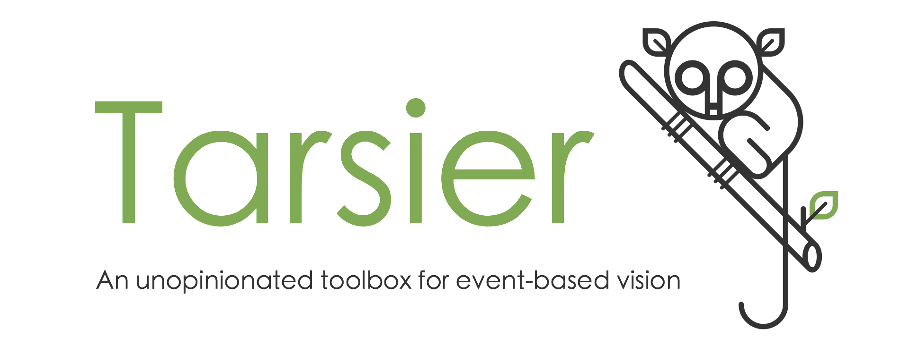

Tarsier is a collection of tools to build event-based algorithms. It is an header-only library.

# install

Within a Git repository, run the commands:

```sh
mkdir -p third_party
cd third_party
git submodule add https://github.com/neuromorphic-paris/tarsier.git
git submodule update --init --recursive
```

# user guides and documentation

User guides and code documentation are held in the [wiki](https://github.com/neuromorphic-paris/tarsier/wiki).

# contribute

## development dependencies

Tarsier relies on [Premake 4.x](https://github.com/premake/premake-4.x) (x ≥ 3) to generate build configurations. Follow these steps to install it:
- __Debian / Ubuntu__: Open a terminal and execute the command `sudo apt-get install premake4`.
- __macOS__: Open a terminal and execute the command `brew install premake`. If the command is not found, you need to install Homebrew first with the command<br />
  `ruby -e "$(curl -fsSL https://raw.githubusercontent.com/Homebrew/install/master/install)"`.

[ClangFormat](https://clang.llvm.org/docs/ClangFormat.html) is used to unify coding styles. Follow these steps to install it:
- __Debian / Ubuntu__: Open a terminal and execute the command `sudo apt-get install clang-format`.
- __macOS__: Open a terminal and execute the command `brew install clang-format`. If the command is not found, you need to install Homebrew first with the command<br />
  `ruby -e "$(curl -fsSL https://raw.githubusercontent.com/Homebrew/install/master/install)"`.

## test

To test the library, run from the *tarsier* directory:
```sh
premake4 gmake
cd build
make
cd release
./tarsier
```

After changing the code, format the source files by running from the *tarsier* directory:
```sh
for file in source/*.hpp; do clang-format -i $file; done;
for file in test/*.cpp; do clang-format -i $file; done;
```

# license

See the [LICENSE](LICENSE.txt) file for license rights and limitations (GNU GPLv3).
